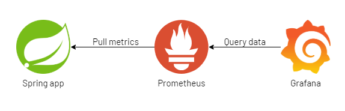

# Observability Lab

# Observability Lab

- **Goal** → apply observability on metrics and logs using prometheus, loki and grafana observability stack on a spring boot backend application.
- **Application** **repository** → https://github.com/Mahmoud-Shereif/observability-lab.git
- **Lab architecture** →
- **Guidelines**:
  - Implement the lab on your local machine.
  - Try if possible to split every service on a separate docker-compose file.
  - It’s better to see the structure of the backend logs before start working on promtail be able to define labels on promtail configuration.
    **See** [https://grafana.com/docs/loki/latest/clients/promtail/pipelines/](https://grafana.com/docs/loki/latest/clients/promtail/pipelines/)
    **See** [https://grafana.com/docs/loki/latest/clients/promtail/stages/json/](https://grafana.com/docs/loki/latest/clients/promtail/stages/json/)
    **See** [https://grafana.com/docs/loki/latest/clients/promtail/stages/labels/](https://grafana.com/docs/loki/latest/clients/promtail/stages/labels/)
  - In grafana we need to filter by `error-code` , `username` and by `text` in the loki dashboard.
    **See** [https://sbcode.net/grafana/dashboard-variables/](https://sbcode.net/grafana/dashboard-variables/)
    **See** [https://grafana.com/docs/grafana/v9.0/variables/](https://grafana.com/docs/grafana/v9.0/variables/)
- **Useful links**:
  1. **Prometheus and Node-Exporter**:
     [https://grafana.com/docs/grafana-cloud/quickstart/docker-compose-linux/#step-1-create-the-compose-file](https://grafana.com/docs/grafana-cloud/quickstart/docker-compose-linux/#step-1-create-the-compose-file)
  2. **Micrometer (Implemented in Spring boot app)**:
     [https://www.tutorialworks.com/spring-boot-prometheus-micrometer/](https://www.tutorialworks.com/spring-boot-prometheus-micrometer/)
  3. **Promtail, Loki and grafana**:
     https://github.com/shazforiot/Promtail-Loki-Grafana-using-Docker-Compose
  4. **Grafana dashboards to import**:
     [https://grafana.com/grafana/dashboards/1860-node-exporter-full/](https://grafana.com/grafana/dashboards/1860-node-exporter-full/)
     [https://grafana.com/grafana/dashboards/11378-justai-system-monitor/](https://grafana.com/grafana/dashboards/11378-justai-system-monitor/)
     [https://grafana.com/grafana/dashboards/12611-logging-universal-dashboard/](https://grafana.com/grafana/dashboards/12611-logging-universal-dashboard/)
- **Hints**:
  - Make the network mode of each service as `host`
    **See** [https://docs.docker.com/network/host/](https://docs.docker.com/network/host/)
    **See** [https://stackoverflow.com/questions/56582446/how-to-use-host-network-for-docker-compose](https://stackoverflow.com/questions/56582446/how-to-use-host-network-for-docker-compose)
  - Take care with volume paths in the docker-compose files.
- **Bonus**:
  - Provide dashboards and alerting data to grafana as a configuration files instead of creating them manually.